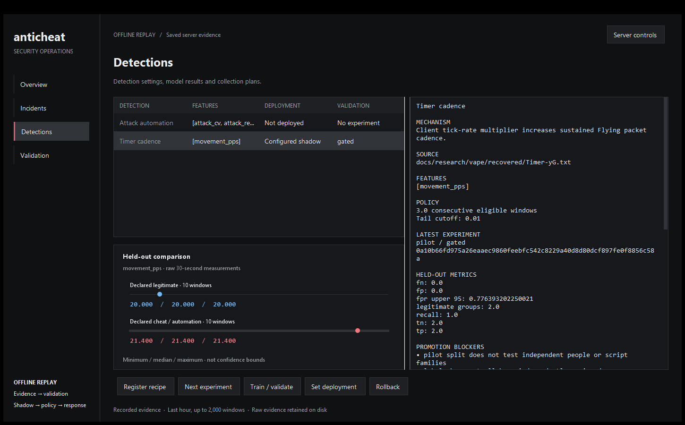
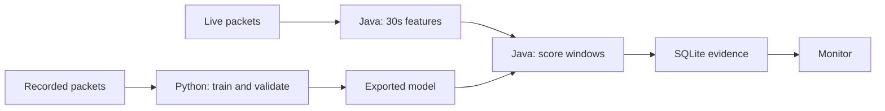

# anticheat

I built this to follow a Minecraft cheat from its implementation to the evidence it
leaves on the server. I reverse engineered parts of Vape, worked through its
obfuscation, and used controlled gameplay recordings to test the resulting detection
ideas. The repo includes the packet capture tools, C++ checks, Python ML experiments
and a Java plugin that scores live behavior.

It's a working research prototype. Timer and Reach have recorded case studies;
broader player and network validation is still open.

[Timer experiments](examples/timer/research/REPORT.md) ·
[Reach recordings](examples/reach/REPORT.md) ·
[ML code](analytics/models.py) ·
[Reverse engineering](docs/VAPE_DETECTIONS.md)



*The desktop console replaying saved evidence. Timer is in shadow mode; the displayed
experiment uses route-based development splits. The monitor also shows live behavior
trends, individual findings and recorded responses.*

## What runs where

The Java plugin observes movement and attack packets and builds 30-second feature
windows. Python trains and evaluates models from admitted recordings. The server
loads exported model coefficients at startup and scores new windows as people play.
SQLite stores the features, model version, decision and response for inspection.



The native checks take a separate path through JNI into C++. Reach, for example,
checks packet geometry directly. The [event boundary](bridge/README.md) defines
what is copied from the packet, what comes from a server snapshot and when an
observation is too uncertain to use.

## Where I used ML

The [training code](analytics/models.py) fits weighted logistic regression and
calibrates its threshold against legitimate groups. The exported Timer candidate
uses movement packets per second. Its coefficients, calibration references and
feature limits are readable in the model file.

There are two evaluation setups. The recorded Timer study holds out entire route
seeds. The independent-validation path groups connected players, combat opponents
and script families together, requires reviewed labels, and checks that test days
are separate from development. Those independent data requirements are still unmet.

The [research comparison](tools/research/evaluate.py) also tries Isolation Forest,
a fixed rate rule and feature ablation: remove cadence and see what the model can
still learn. Reports retain the splits, coefficients, predictions and source hashes.
Synthetic batching and pause replays test whether receive timing changes the result.

In live use, the model requires consecutive eligible windows, checks whether the
features fall within its training range, and limits repeated statistical tests per
session. A score or tail rank is not a probability that someone is cheating.
Training and deployment are explicit steps; the server loads a fixed model.

## Timer: the useful result was the failure

The recovered Timer code writes a client timer multiplier and restores it to `1.0`
when disabled. I recorded matching movement seeds under vanilla and declared Vape
Timer `1.07` conditions: **17 recordings, eight matched pairs, 124,340 raw events**.
The matched rate was about **20.0 movement packets/s versus 21.4**.

The model with multiple features separated the local recordings perfectly. Then I
replayed the receive timestamps with synthetic 100 ms batching:

| Model | Vanilla flagged | Vanilla flagged after batching | Timer detected in both cases |
|---|---:|---:|---:|
| Fixed rate rule | 0 / 9 | 0 / 9 | 8 / 8 |
| Logistic, multiple features | 0 / 9 | 9 / 9 | 8 / 8 |
| Logistic, rate only | 0 / 9 | 0 / 9 | 8 / 8 |

That changed what I trusted. The extra features made the first model sensitive to
arrival timing. The simple rule matched the rate-only model on these recordings,
so this study doesn't establish an advantage from ML. Rate-only was a refinement
after seeing the failure and still needs fresh validation.

The [full report](examples/timer/research/REPORT.md) includes the weaker Isolation
Forest result and the cadence ablation. These are scripted recordings from one
player on localhost, already inspected during development. They establish a local
effect; they don't estimate reliability across a population of players.

## Reach: follow an attack back to the packet

The [Reach study](examples/reach/REPORT.md) has **23 stationary recordings** from
two accounts. At center distances of 3.5 and 3.6 blocks, the OFF control sent zero
attack requests. Declared Reach `3.2` sent **66 and 68** respectively. Each evaluated
request can be traced through SQLite to its original packet and native verdict.

The check measures a conservative distance from the attacker's eye history to an
expanded target box. All **258 control requests** were within its bound. It skips
moving or otherwise unsupported observations; reconstructing the target as the
attacking client saw it is still unfinished. The study measures attack requests,
so those counts aren't claims about successful damage.

## Collection and the next experiment

The [collection controller](tools/autosample/README.md) drives actual Minecraft
clients through matched routes and saves the input plan alongside raw observations.
Admission checks capture integrity and source hashes before a sample enters the
registry. Labels come from declared conditions and evidence review.

The [planner](analytics/planner.py) reads that registry and recommends the next
experiment. For the current Timer data, it asks for Vape with Timer OFF and ON on
the same client build and route: the existing comparison also changes the client.
It supplies a timed procedure, metadata templates and the remaining validation
requirements. The console exposes it through **Detections → Next experiment**.

For bot and macro work, the extractor already measures attack interval variation,
rate and repeated intervals. There is an [attack automation recipe](analytics/recipes/attack_macro.json),
and a [matched human/AutoClicker collection workflow](tools/autosample/README.md#human-versus-autoclicker-pilot),
but no recorded macro dataset or trained macro classifier yet. Both sides of the
Timer experiment used automated movement, so vanilla here cannot serve as a
human-input control.
The planner uses fixed rules to identify missing evidence; it doesn't invent labels
or choose experiments through a learned model.

## What's left

- Independent human, client and network validation. The current ML model stays in
  shadow and cannot be promoted to enforcement under the default requirements.
- A human-versus-macro recording study, with separate people and script families
  held out. The feature and review paths are implemented; the dataset is missing.
- Moving-combat Reach and broader version/terrain coverage. The adapter currently
  targets direct protocol-47 clients and Spigot 1.8.8 `v1_8_R3`.
- Larger-corpus performance measurements. These local recordings don't establish
  capacity or accuracy for a large server network.
- An apparent legitimate Timer-budget flag, documented in the
  [incident notes](docs/TIMER.md#local-live-enforcement-test). That native rule has
  its own enforcement policy and defaults to reporting only.

The [validation requirements](analytics/README.md#validation-requirements) explain
the sample counts and uncertainty bounds. More recordings help only if they add
the kinds of independent evidence the model is missing.

## Try the recorded studies

Run from the repo root with Python 3.11+. The included captures can be analyzed
without launching Minecraft:

```powershell
python -m pip install -r analytics/requirements.txt
python tools/research/evaluate.py --database examples/timer/anticheat.sqlite --output build/timer-research
python tools/reach/analyze.py --study examples/reach --output build/reach-study
```

The Timer command writes model inputs, fold results and a report. The Reach command
audits captures and archived native verdicts, then writes `results.sqlite` with
individual attack observations. Its [study report](examples/reach/REPORT.md#reproduce-and-inspect)
also shows how to rerun the compiled check. The [analytics walkthrough](analytics/README.md#reproduce-timer)
covers registry import, model training and `plan-next`.

<details>
<summary>Build the plugin, native checks and desktop console</summary>

The Windows build needs x64 MSVC, CMake, Ninja, a JDK 11+ and a local Spigot 1.8.8
JAR. Open a Visual Studio x64 developer PowerShell and set the paths for your machine:

```powershell
.\build.ps1 -Jdk $env:JAVA_HOME -ServerJar 'C:\path\to\spigot-1.8.8.jar'
python -m unittest discover -s analytics -p 'test_*.py'
python -m unittest discover -s tools/research -p 'test_*.py'
python -m unittest discover -s tools/reach -p 'test_*.py'
```

The build runs native, JNI, packet-adapter, recording and runtime tests. Install
`build/libs/anticheat.jar` in the server's `plugins/` directory and
`build/native/anticheat_native.dll` in `plugins/FoxAntiCheat/`. The server uses Java 8.

For the desktop, build with `tools/monitor/build.ps1 -Jdk <JDK root>` using JDK 21,
then configure paths as described in the [monitor README](tools/monitor/README.md).
Model deployments load on server restart. Start with shadow/report mode.

Native checks can also be built separately:

```text
cmake -S . -B build/core -G Ninja -DAC_BUILD_JNI=OFF
cmake --build build/core
ctest --test-dir build/core --output-on-failure
```

</details>

## Files worth opening

| Question | Code |
|---|---|
| What did the client change? | [Recovered operations and field evidence](docs/VAPE_DETECTIONS.md) |
| How do packets become ML inputs? | [Offline features](analytics/windows.py) · [Live Java features](plugin/src/main/java/dev/fox/anticheat/report/BehaviorTelemetry.java) |
| How is the model trained and checked? | [Training and calibration](analytics/models.py) · [Transport replay](analytics/stress.py) |
| What runs on the live server? | [Model runtime](plugin/src/main/java/dev/fox/anticheat/report/BehaviorRuntime.java) · [Native Reach](engine/src/checks/reach.cpp) |
| What data should be collected next? | [Planner](analytics/planner.py) · [Detection recipes](analytics/recipes/) |
| How do I inspect a decision? | [Desktop console](tools/monitor/) · [Reach packet queries](examples/reach/REPORT.md#reproduce-and-inspect) |
